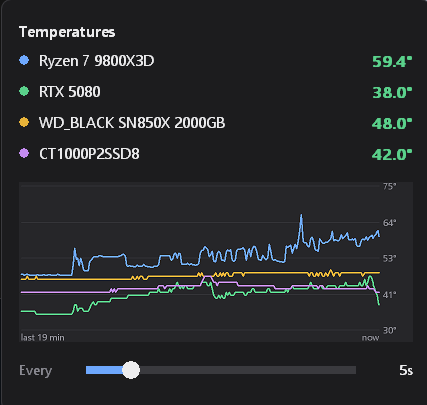

<p align="center">
  
</p>

<h1 align="center">tempmanager</h1>

<p align="center">
  A tiny Windows tray app that shows your CPU, GPU, and SSD temperatures at a glance.
</p>

<p align="center">
  <a href="https://github.com/ExplodingCB/tempmanager/releases/latest"></a>
  
  
  <a href="LICENSE"></a>
</p>

<p align="center">
  
</p>

## Features

- **Live temperature in the taskbar.** The tray icon shows the hottest reading
  (or just the CPU or GPU) and turns amber, then red, as it heats up.
- **Popup with history.** Click the icon for every sensor plus a chart of up to
  the last 240 readings.
- **Covers the main hardware.** AMD Ryzen CPUs, NVIDIA GPUs, and NVMe/SATA drives.
- **Barely there.** Native Win32 and Rust with no runtime or framework. The
  installer is about 2 MB.
- **Adjustable sampling.** From every second up to every 5 minutes. Celsius or
  Fahrenheit. Can start with Windows.

## Install

```powershell
winget install ExplodingCB.tempmanager
```

Or download `tempmanager-setup-<version>.exe` from the
[latest release](https://github.com/ExplodingCB/tempmanager/releases/latest)
and run it. The installer is per-user by default (no admin prompt), adds a Start
menu entry, and can be removed from **Settings > Apps**. A portable
`tempmanager.exe` is attached to each release as well.

Requirements: 64-bit Windows 10 or 11. CPU temperatures on AMD Ryzen need the
AMD SDK and an elevated process; see [SETUP.md](SETUP.md).

> The executable and installer are not code-signed, so SmartScreen may show
> "Windows protected your PC" the first time. Choose **More info > Run anyway**.

## Usage

Left-click the tray icon to open the popup. The slider changes the background
sampling interval from 1 second to 5 minutes. It saves on release; the popup
continues requesting live readings while open.

Right-click to choose the tray source (hottest / first CPU / first GPU), switch
Celsius/Fahrenheit, toggle Start with Windows, restart elevated when needed, or exit.
Settings are stored in `%APPDATA%\tempmanager\config.ini`.

Start with Windows uses a scheduled task when configured while elevated and a
Run-key entry otherwise. The existing startup controls do not reliably report
registration failures; see the remaining findings in the
[review report](audit/REVIEW.md).

---

# Technical details

## Sensor sources and accuracy

| Source | Interface | Requirements / resolution |
|---|---|---|
| NVIDIA GPU | NVML from the installed display driver | No elevation; whole degrees Celsius |
| NVMe / SATA drives | Windows storage temperature property | Supported storage driver; whole degrees Celsius |
| AMD Ryzen CPU | Ryzen Master Monitoring SDK | Compatible SDK and elevated process; displayed to 0.1 C |
| AMD Ryzen CPU fallback | SMU registers through an existing WinRing0-compatible driver | Supported CPU/register layout and accessible driver |

The CPU backend prefers AMD's SDK. See [SETUP.md](SETUP.md) for setup and
limitations. Intel CPU and AMD/Intel GPU temperature backends are not implemented.

The app displays the readings supplied by these interfaces; it cannot calibrate
physical sensors. CPU package, CCD, GPU core, and drive composite temperatures
measure different things. The SDK and direct SMU backend can differ in sampling
and averaging. A displayed decimal does not imply 0.1 C sensor accuracy.

A read failure becomes `--` and a gap in the chart. CCD values are matched to their
sensor IDs, so a missing CCD cannot shift another CCD's temperature into its row.
Amber/red values are fixed display thresholds, not hardware-specific thermal limits.

Discovery runs once at startup. Restart after connecting a new drive/GPU or
changing a driver. Storage discovery currently checks PhysicalDrive0 through 15.

## Sampling and footprint

- One application thread uses a blocking Win32 message loop. Windows and sensor
  DLLs may create additional threads.
- The default background interval is 30 seconds. The popup requests 1-second
  sampling; actual calls respect the backend's minimum interval. Short intervals
  improve freshness at the cost of more driver calls and device wakeups.
- Background timers allow coalescing. Actual timestamps, including time spent
  asleep, determine both chart spacing and its elapsed-time caption.
- The chart retains and displays at most 240 readings: roughly two hours at
  30 seconds, or four minutes at 1 second. Each sensor uses a 480-byte temperature
  buffer and all sensors share a 1,920-byte timeline.
- Sensor buffers and drive paths are allocated once. Changed readings can still
  allocate display strings and GDI resources; unchanged readings skip tray
  formatting. The shell is notified only when the visible icon or tooltip changes.
- The popup is created on first use and painted only when needed. Fonts and
  bitmaps are released after painting.
- Drive handles are opened only for each query. Polling can still wake a device;
  short-lived handles do not guarantee that the drive remains asleep.
- Windows manages resident memory. The app does not forcibly trim its working
  set, which would lower the resident-memory counter without releasing private
  committed memory and can cause page faults on subsequent use.

Working set, private bytes, CPU time, and thread count vary with the loaded
sensor libraries and process privileges. See [the review report](audit/REVIEW.md)
for measured results, methodology, and limits; the old 1.8 MB figure was not a
complete account of the process's memory.

## Diagnostics

```powershell
.\tempmanager.exe --probe
```

Reads the available sensors once and writes `probe.txt` next to the executable.
The GUI executable has no console; wait for the process to exit before reading
its output. Run from a writable folder.

```powershell
.\tempmanager.exe --shot
```

Writes an offscreen `popup.bmp` to inspect the layout. Its chart and displayed
values are synthetic test data; use `--probe` for actual temperatures.

## Building and checking

The project targets x64 Windows with the Rust GNU toolchain:

```powershell
rustup toolchain install stable-x86_64-pc-windows-gnu
cargo build --release
cargo test
cargo clippy --all-targets -- -D warnings
cargo fmt --check
```

The normal output is `target/x86_64-pc-windows-gnu/release/tempmanager.exe`.
A running executable is locked. To build separately without interrupting it:

```powershell
cargo build --release --target-dir target/review-build
```

Run the additional offscreen GDI resource check explicitly on Windows:

```powershell
cargo test repeated_paint_releases_gdi_objects -- --ignored --nocapture --test-threads=1
```

A repeatable resource-measurement script is in `audit/measure.ps1`. It launches
its own process with isolated settings and stops only that process afterward.

## Releasing

Pushing a `v*` tag runs `.github/workflows/release.yml`, which builds, tests,
embeds the app icon, compiles the installer from `installer/tempmanager.iss`,
and publishes a GitHub release with the installer and portable exe. To do the
same locally, install [Inno Setup 6](https://jrsoftware.org/isinfo.php) and run:

```powershell
cargo build --release
.\scripts\set-exe-icon.ps1 target\x86_64-pc-windows-gnu\release\tempmanager.exe assets\tempmanager.ico
iscc /DAppVersion=0.1.0 installer\tempmanager.iss
```

The icon is patched into the finished exe because the GNU toolchain ships no
resource compiler.

The installer lands in `dist/`. After a release is published, submit the new
version to winget with
[wingetcreate](https://github.com/microsoft/winget-create):

```powershell
wingetcreate update ExplodingCB.tempmanager --version 0.2.0 --urls https://github.com/ExplodingCB/tempmanager/releases/download/v0.2.0/tempmanager-setup-0.2.0.exe --submit
```

## Code layout

`src/main.rs` owns the message loop and menu; `app.rs` coordinates sampling;
`popup.rs`, `graph.rs`, and `tray.rs` draw the UI; `history.rs` holds bounded
buffers; `config.rs` loads and saves settings; `sensors/` contains discovery,
NVML, Windows storage, AMD SDK, and direct SMU backends.
